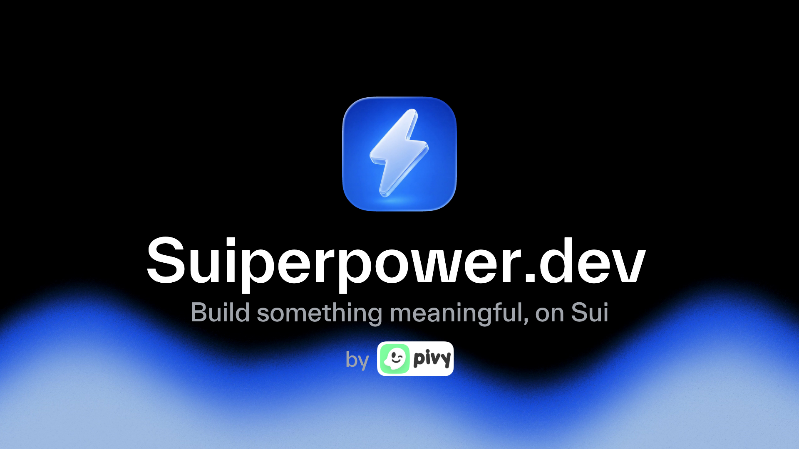

<div align="center">



# Suiperpower

**Build something meaningful, on Sui.**

A superpower for AI coding agents to ship real products on Sui.

[Website](https://suiperpower.dev) · [Skills](https://suiperpower.dev/skills) · [GitHub](https://github.com/pivyme/suiperpower) · [Sui Overflow 2026](https://overflow.sui.io)

</div>

---

Your AI coding agent has never written Move before. Suiperpower fixes that.

It's an open platform of 60 production-grade skills, a curated ecosystem catalog, a Sui knowledge base, and a CLI that turns Claude Code, Codex, Cursor, or Grok Build into a senior Sui engineer sitting next to you. One curl install, four agents, every Sui project from here on.

Built around an explicit anti-slop bar so the project survives past the hackathon, not just wins it.

## Install

```bash
curl -fsSL https://suiperpower.dev/setup.sh | bash
```

Requirements: Node.js 20+, git.

The installer writes Codex skills to `~/.codex/skills/`, Cursor rules to `~/.cursor/rules/`, Grok Build skills to `~/.grok/skills/`, and prints the Claude Code plugin commands:

```text
/plugin marketplace add pivyme/suiperpower
/plugin install suiper@suiperpower
```

Two bin entries resolve to the same dispatcher. `suiper` for daily typing, `suiperpower` for the unambiguous brand. Both work everywhere.

```bash
suiper init       # set up agents in this repo
suiper doctor     # check your install
suiper update     # pull the latest skills
```

## Drive it

```bash
claude "/suiper:find-next-sui-idea what should I build for Sui Overflow?"
claude "/suiper:scaffold-project escrow with Walrus storage"
claude "/suiper:build-with-claude help me build the MVP"
claude "/suiper:build-with-move add the lock function"
claude "/suiper:deploy-to-testnet"
claude "/suiper:submit-to-sui-overflow"
```

Use the `/suiper:` prefix in Claude Code. Use the bare skill name in Codex, Cursor, and Grok Build. Skills auto-route by intent, so you mostly don't need to remember names.

## Why this exists

Most Sui hackathon submissions are built for the hackathon, not to actually become a product. They die the moment the prize is paid. No business model, no retention loop, no real users.

The Sui team made the bar explicit for Overflow 2026:

> Judging criteria place much stronger emphasis on product quality, real-world application, technical execution, and overall polish.

Suiperpower is shaped around that bar. Every build skill embeds a "will this survive past the hackathon" gate. The sponsor integrations are load-bearing, not decoration. The submission flow refuses to package against placeholder content.

From the creator:

> Most Sui hackathon submissions are built for the hackathon, not to actually become a product. That always bothered me. So I poured my product thinking into Suiperpower, so the agent acts like a brutally honest senior engineer that won't sugarcoat anything. This is my giveback to the Sui community. If it raises the bar of what gets shipped on Sui, that is the win.

[Kelvin Adithya](https://klvn.dev), co-founder of [PIVY](https://pivy.me) (1st place, Payment & Wallets track, Sui Overflow 2025).

## What it is, what it isn't

It is:

- A single source of senior Sui taste for any AI agent in your editor
- A skill library grounded in real Sui docs, OpenZeppelin Move, sponsor APIs, not training-data guesses
- A CLI with zero runtime deps, ESM TypeScript, opt-in anonymous telemetry
- Open source, MIT, independent

It isn't:

- A Sui Foundation product
- A webapp, dashboard, or signup flow
- A hackathon-only tool
- A paid product

## The journey

Six phases. Skills hand off through the filesystem so your agent never loses context between them.

| # | Phase | What happens |
|---|---|---|
| 01 | **Learn** | Get oriented on Sui without a 50-tab research session |
| 02 | **Idea** | Pressure-test what you want to build before writing a line of code |
| 03 | **Build** | Scaffold, integrate, iterate, with Sui knowledge your agent can read |
| 04 | **Ship** | Get to mainnet without skipping the gates that catch real bugs |
| 05 | Grow | Earn first users, not just a launch tweet *(in progress)* |
| 06 | Earn | Turn real users into real revenue, not vanity metrics *(in progress)* |

Each phase writes context to `.suiperpower/` in your project. The next phase reads it automatically.

```
find-next-sui-idea      writes →  .suiperpower/idea-context.md
scaffold-project        reads  ←
build-with-claude       writes →  .suiperpower/build-context.md
deploy-to-testnet       reads  ←
submit-to-sui-overflow  reads  ←  .suiperpower/deploy-context.md
```

Handoff is optional, not a gate. Any skill can be invoked standalone.

## Skills (60 today)

Grouped by what they actually do, so you can find the one you want.

### Learn (2)
`sui-beginner` · `learn`

### Idea (7)
`find-next-sui-idea` · `validate-idea` · `competitive-landscape` · `deepbook-research` · `defillama-sui` · `walrus-research` · `overflow-copilot`

### Build (43)

**Intent loop.** Plan and verify against intent, the wrapper around all build work.
`clarify-intent` · `plan-before-code` · `verify-against-intent` · `navigate-skills`

**Foundations.** Move, PTBs, objects, debug, review.
`scaffold-project` · `build-with-claude` · `virtual-sui-incubator` · `build-with-move` · `ptb-composer` · `object-model-design` · `debug-move` · `review-move`

**Sui-native integrations.** Sponsor and ecosystem primitives.
`walrus-storage` · `walrus-sites` · `deepbook-orderbook` · `cetus-swap` · `scallop-money-market` · `navi-lending` · `pyth-oracle` · `seal-access-control` · `nautilus-offchain` · `suins-integration` · `openzeppelin-sui-libs` · `eve-frontier` · `ottersec-prep`

**App patterns.** Common product shapes on Sui.
`build-ai-agent` · `build-data-pipeline` · `sui-zk-login` · `sponsored-transactions` · `kiosk-marketplace` · `build-mobile-sui` · `launch-coin`

**Design and frontend.** Taste, not slop.
`brand-design` · `frontend-design-guidelines` · `number-formatting` · `page-load-animations` · `design-taste`

**Anti-slop and product.** The senior engineer who won't sugarcoat.
`product-review` · `roast-my-product` · `validate-business-model` · `retention-loop` · `will-real-users-pay`

**Security.** `cso`

### Ship (8)
`deploy-to-testnet` · `deploy-to-mainnet` · `pick-my-sui-track` · `submit-to-sui-overflow` · `create-pitch-deck` · `marketing-video` · `video-craft` · `apply-grant`

Browse the live tree under [`core/skills/`](core/skills/) or the rendered catalog at [suiperpower.dev/skills](https://suiperpower.dev/skills).

## Anti-slop, the actual differentiator

Every build skill answers one question. Will this survive past the hackathon. If the answer is no, the agent says so.

- `/validate-business-model` who pays, how much, why they keep paying
- `/retention-loop` what pulls users back on day 7, day 30
- `/will-real-users-pay` cheap pricing experiments before launch
- `/roast-my-product` brutal critique, investor-grade
- `/product-review` balanced UX evaluation from a first-time user POV
- `/review-move` code quality and security review against the OWASP / Move ability checklist

`/submit-to-sui-overflow` refuses to generate a submission against placeholder content. The live URL must work, the package must verify on chain, the media must exist at the right dimensions. The skill is on your side, not the judges'.

## Sponsor integrations

Real integrations only. `/pick-my-sui-track` recommends a track based on actual integration depth in your repo, not marketing intent.

| Sponsor | Role | First-class skills |
|---|---|---|
| **Walrus** | Headline partner | `/walrus-storage`, `/walrus-sites`, `/walrus-research` |
| **DeepBook** | Track sponsor | `/deepbook-orderbook`, `/deepbook-research` |
| **OpenZeppelin** | Prize sponsor | `/openzeppelin-sui-libs` |
| **OtterSec** | Prize sponsor | `/ottersec-prep` |
| **Scallop** | University award | `/scallop-money-market` |

Also wired in: Pyth, Seal, Nautilus, SuiNS, zkLogin, Cetus, NAVI, Kiosk, EVE Frontier.

## Ecosystem catalog

Curated, source-checked, regenerated each release. Lives in `core/cli/data/`, browseable from the website, queryable from inside any skill.

| Catalog | Entries |
|---|---|
| Clonable Sui repos | 124 |
| Community skills | 66 |
| MCP servers | 20 |
| Curated Sui startup ideas | 259 |

## Multi-agent

| Agent | Install path | Invocation |
|---|---|---|
| Claude Code | Plugin marketplace, namespaced | `/suiper:<skill-name>` |
| Codex | `~/.codex/skills/<skill-name>/` | bare skill name |
| Cursor | `~/.cursor/rules/<skill-name>.mdc` | bare skill name |
| Grok Build | `~/.grok/skills/<skill-name>/` | bare skill name (`/<skill-name>`) |

Grok Build reads the Anthropic skill format straight from `~/.grok/skills/`, the same `SKILL.md` we ship, so it needs no separate generator. `suiper init` writes Codex, Cursor, and Grok formats by default and prints the Claude plugin install commands. `suiper init --vendor` writes all four into the current repo under namespaced folders, so teammates inherit the skill set on clone.

### Vendor mode

```bash
suiper init --vendor
```

Writes skills into `<repo>/.claude/skills/suiperpower/`, `<repo>/.codex/skills/suiperpower/`, `<repo>/.cursor/rules/suiperpower/`, and `<repo>/.grok/skills/suiperpower/`. Commit, push, done. Teammates clone and their agents are ready.

### Per-skill install

Already know which skill you want? Install à la carte via [skills.sh](https://skills.sh):

```bash
npx skills add pivyme/suiperpower/skills/build/build-with-move
npx skills add pivyme/suiperpower/skills/idea/find-next-sui-idea
```

The curl one-liner stays canonical. Per-skill is for users who already have a target.

## Telemetry

Opt-in, anonymous by default. Tracks which skills get used and how long they take. No code, no file paths, no PII. Configure in `~/.suiperpower/config.json`:

```text
"off" | "anonymous" (default) | "community"
```

Source is public: [convex/telemetry.ts](convex/telemetry.ts). Read it before you trust it.

## Project structure

```
core/cli/         CLI source and ecosystem catalog data
core/skills/      Journey skills, knowledge base, curated ideas
core/install.sh   Bash bootstrap, hosted at suiperpower.dev/setup.sh
convex/           Telemetry and feedback backend
web/              Marketing site, deployed on Vercel
CLAUDE.md         Context for AI agents working on Suiperpower itself
AGENTS.md         Agent-facing operating rules
```

Monorepo via pnpm workspaces. Three packages: `@pivyme/suiperpower` (published CLI), `@suiperpower/convex`, `@suiperpower/web`.

## Made by

Built by the [PIVY](https://pivy.me) team. PIVY won 1st place in the Payment & Wallets track at [Sui Overflow 2025](https://blog.sui.io/2025-sui-overflow-hackathon-winners/). We built Suiperpower to pass that same bar back to every Sui builder.

| | Who | |
|---|---|---|
|  | **Kelvin Adithya** | Creator. [klvn.dev](https://klvn.dev) |
|  | **Febi Mettasari** | [@febimettasari](https://www.instagram.com/febimettasari) |
|  | **Louis Arvin** | [LinkedIn](https://www.linkedin.com/in/louis-arvin-8a8488268) |
|  | **Tengku Farhan** | Site. [hanebox.github.io](https://hanebox.github.io) |

Independent project, MIT licensed, no Sui Foundation endorsement claimed.

## Contributing

PRs welcome. Lowest-friction ways in:

- Add a repo, MCP, or idea to `core/cli/data/*.json`
- Improve a skill's references or workflow
- Write a sponsor doc grounded in real source
- File an idea or bug in [GitHub Issues](https://github.com/pivyme/suiperpower/issues)

Before opening a PR: read [CONTRIBUTING.md](CONTRIBUTING.md), [AGENTS.md](AGENTS.md), and the skill authoring rules in [CLAUDE.md](CLAUDE.md). Skills must be grounded in real sources, not training-data guesses. Sui drifts fast.

## Update and uninstall

```bash
suiper update      # or just re-run the curl install, both idempotent
suiper uninstall   # removes only files Suiperpower wrote
```

## Credits

Powered by the Sui ecosystem:

- [Sui Foundation](https://sui.io) and [Mysten Labs](https://github.com/MystenLabs), the protocol
- [Walrus](https://walrus.site), decentralized blob storage
- [DeepBook](https://deepbook.tech), on-chain CLOB
- [Scallop](https://scallop.io), money market
- [OpenZeppelin](https://openzeppelin.com), audited Move libraries
- [OtterSec](https://ottersec.io), Sui Move audits

And every Sui ecosystem team building primitives the rest of us depend on.

## License

[MIT](LICENSE)

## Links

- [suiperpower.dev](https://suiperpower.dev)
- [Skills catalog](https://suiperpower.dev/skills)
- [GitHub](https://github.com/pivyme/suiperpower) · [Twitter / X](https://x.com/suiperpower)
- [Sui Overflow 2026](https://overflow.sui.io) · [Submission portal](https://www.deepsurge.xyz/hackathons/b587dc0c-4cb8-4e63-ada5-519df38103bf) · [Telegram](https://go.sui.io/suioverflow2026-tg)
- [Sui Docs](https://docs.sui.io) · [Participant Handbook](https://go.sui.io/overflow26-participant-handbook)
