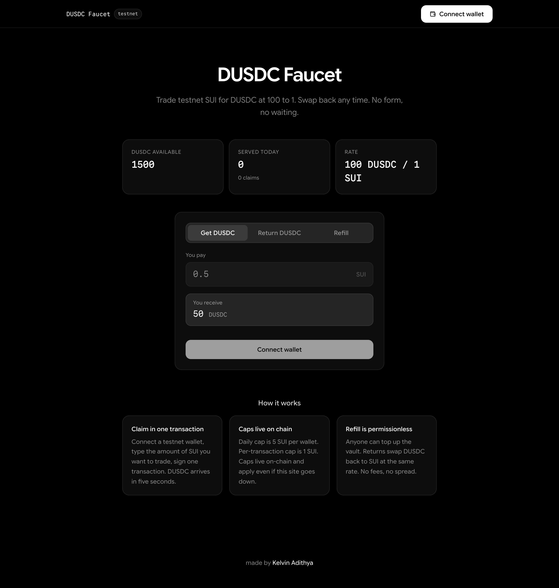
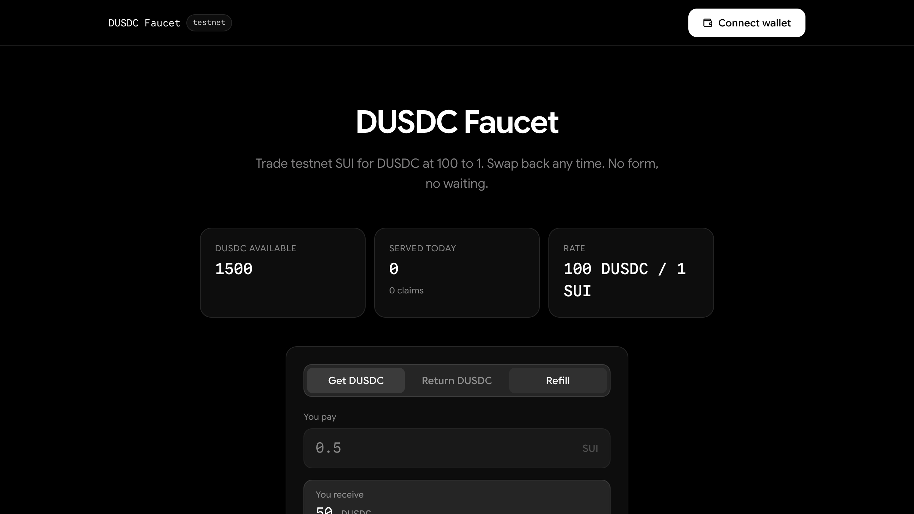
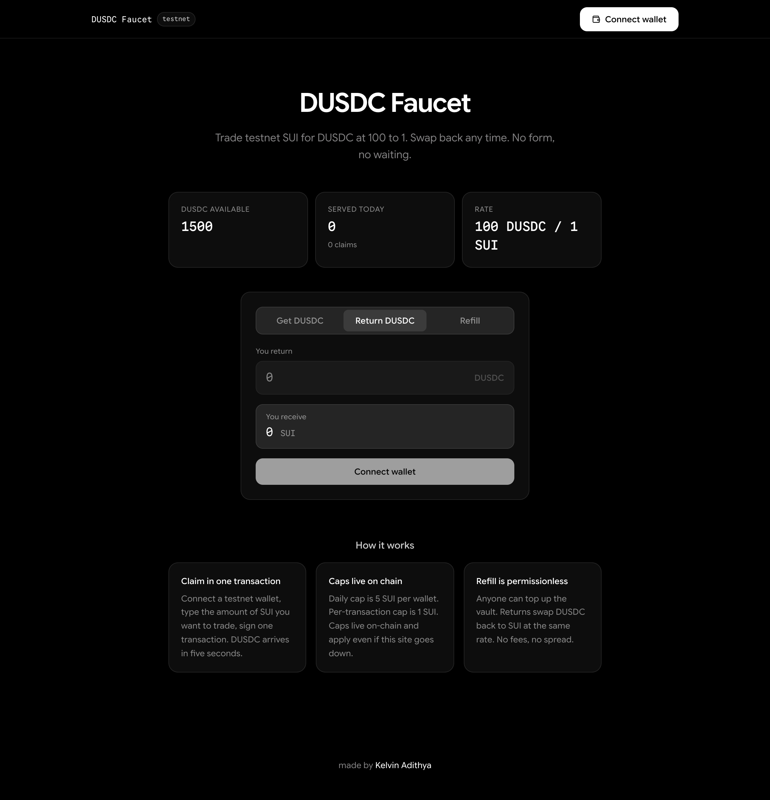
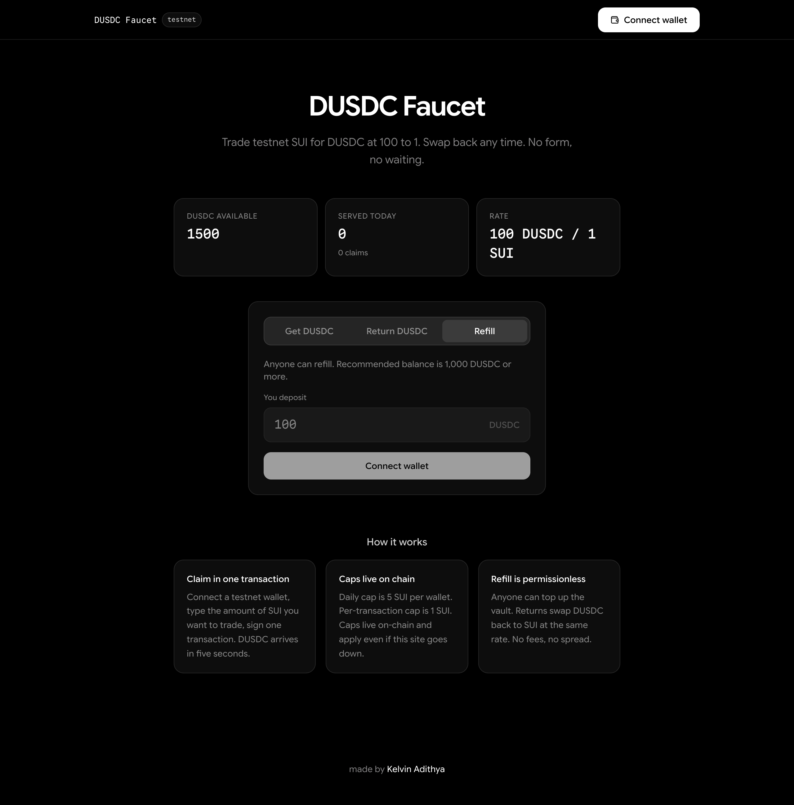

# DUSDC Faucet

A self-serve faucet for DUSDC on Sui testnet. Trade testnet SUI for DUSDC at 1 to 1, swap back any time, anyone can refill the vault. Replaces the existing Tally form for DeepBook Predict testnet onboarding.



## What it does

- **Get DUSDC**: connect a Sui testnet wallet, type the SUI amount, sign one transaction, receive DUSDC.
- **Return DUSDC**: swap DUSDC back to SUI at the same rate, no spread, no fee.
- **Refill**: anyone can top up the vault. Permissionless on-chain.

Caps live on-chain. Per transaction: 1 SUI. Per wallet per day: 5 SUI. Off-chain Turnstile + IP/fingerprint limits are convenience layers; the on-chain cap is the actual security floor.

## Deployed at

Testnet rehearsal build (v0.1.0), live with the throwaway test DUSDC coin until DeepBook hands over the real coin type.

| Field | Value |
| --- | --- |
| Network | Sui testnet |
| Faucet package id | `0x4cf98e90fcbcb37657939a4c930a70932147dee3899449f502eef641b9886f3d` |
| Faucet object id | `0x27c05925fc39dab2526a866523d45c0c0533af1a420289e0d5a31cd5d67a6875` |
| DUSDC coin type | `0x3f8b178ff847bd88e7335dc04ca48d3307c3ef9d9b252dc971c59eac78321472::test_dusdc::TEST_DUSDC` |
| AdminCap holder | `0x3935bbb26c147851285c0fd76c712e5ccc7669908c2327a1301db52563b12e71` |

Inspect on Suiscan: `https://suiscan.xyz/testnet/object/0x27c05925fc39dab2526a866523d45c0c0533af1a420289e0d5a31cd5d67a6875`.

## Tech stack

| Layer | Tech |
| --- | --- |
| Contract | Sui Move (testnet), generic over the quote coin |
| Backend | Bun + Fastify + Prisma + Postgres (port 4127) |
| Frontend | TanStack Start + React 19 + HeroUI v3 + Tailwind v4 (port 3200) |
| Wallet | @mysten/dapp-kit, testnet |
| Bot gate | Cloudflare Turnstile |

## Quickstart

Prerequisites: bun, sui CLI, a local Postgres, a funded Sui testnet keypair.

```bash
# from repo root
cd packages/dusdc-faucet

# 1. install
cd backend && bun install && cd ../web && bun install && cd ..

# 2. env (dev stub gives you local mocks)
cp .env.local-stub .env
cp .env backend/.env
cp .env web/.env

# 3. database
cd backend && bun run db:push && cd ..

# 4. publish contracts (interactive)
bun run scripts/deploy.ts --which=test
# paste the returned ids into backend/.env and web/.env

# 5. run
cd backend && bun dev      # terminal 1, http://localhost:4127
cd web && bun dev          # terminal 2, http://localhost:3200
```

Full live-deploy steps with the real DUSDC coin type live in `bigdev/plans/06-DEPLOY-AND-ADMIN.md`.

## Demo arc


A two-minute walkthrough:

1. **The problem**, the existing Tally form is the bottleneck.
2. **The page**, vault stats live on-chain, three tabs.
3. **Claim**, type 0.5 SUI, sign, receive 50 DUSDC in five seconds.
4. **Return**, swap 50 DUSDC back to 0.5 SUI at the same rate.
5. **Refill**, anyone tops up the vault, permissionless.
6. **Handover**, the AdminCap is transferable to DeepBook so the faucet is theirs to tune.

Full script with timing in `bigdev/claude/demo-script.md`. Day-of checklist in `bigdev/claude/preflight.md`.

## Project structure

```
packages/dusdc-faucet/
├── contracts/
│   ├── faucet/             Move package, generic over the quote coin
│   └── test-dusdc/         throwaway rehearsal coin
├── backend/                Bun + Fastify, /verify, /stats, /tx-hint
├── web/                    TanStack Start, single page, three tabs
├── scripts/                deploy.ts, e2e-rehearsal.ts, seed/reset
├── docs/screenshots/       README screenshots
└── bigdev/                 plans + autonomous build loop tooling
```

## Screenshots





## Env

`.env.example` at this folder's root documents every variable in one place.

Backend (`backend/.env`): `DATABASE_URL`, `JWT_SECRET`, `SUI_RPC_URL`, `FAUCET_PACKAGE_ID`, `FAUCET_OBJECT_ID`, `DUSDC_COIN_TYPE`, `TURNSTILE_SECRET`.

Frontend (`web/.env`): `VITE_API_URL`, `VITE_SUI_NETWORK`, `VITE_SUI_RPC_URL`, `VITE_FAUCET_PACKAGE_ID`, `VITE_FAUCET_OBJECT_ID`, `VITE_DUSDC_COIN_TYPE`, `VITE_TURNSTILE_SITE_KEY`.

`.env.local-stub` ships Cloudflare's always-pass test keys for local dev. Real keys go in `.env` (gitignored) and the deploy platform UI.

## Tests

```bash
# Move
cd contracts/faucet && sui move test

# Backend (after `bun install` and tests are wired in Phase 15)
cd backend && bun test

# Frontend build
cd web && bun run build

# End-to-end against testnet (needs E2E_SIGNER_PRIVATE_KEY in .env)
bun run scripts/e2e-rehearsal.ts
```

The pre-handover confidence checklist lives in `bigdev/plans/07-TEST-PLAN.md`.

## Deployment

- **Backend**: Render / Railway / Fly.io, set env in the dashboard, port 4127. Dockerfile already present.
- **Frontend**: Vercel, Root Directory `packages/dusdc-faucet/web`, framework preset Vite, build `bun run build`, output `.output`.
- **Contracts**: `bun run scripts/deploy.ts`, publishes and creates the shared Faucet on testnet.

Full instructions in `bigdev/plans/06-DEPLOY-AND-ADMIN.md`.

## Autonomous build loop

Most of this repo was scaffolded by an autonomous build loop. The plans live in `bigdev/plans/`, the phased TODO in `bigdev/TODO.md`, the orchestrator + per-iter builder prompts in `bigdev/claude/`.

To continue or restart the loop:

```bash
./bigdev/autobuild              # start (or attach to running) session
./bigdev/autobuild status       # is it running, how many durable rules
./bigdev/autobuild say "rule"   # durable steering, persists to requirements-log
./bigdev/autobuild fix "msg"    # one-shot transient inject
./bigdev/autobuild kill         # stop cleanly
```

## Pending DeepBook handover

Two items wait on DeepBook input. They are tracked in `bigdev/TODO.md` Phase 26 as deferred substeps; the v0.1.0 rehearsal deploy is independent of both and stays usable in the meantime.

1. **Republish with the real DUSDC coin type.** The Move package is coin-generic. When DeepBook hands over the real `coin_type`, run `bun run scripts/deploy.ts --which=real --dusdc-type=<TYPE>` and rotate `FAUCET_PACKAGE_ID`, `FAUCET_OBJECT_ID`, `DUSDC_COIN_TYPE` in `.env`.
2. **Transfer the AdminCap.** Once DeepBook provides a recipient, call `${FAUCET_PACKAGE_ID}::faucet::transfer_admin(AdminCap, recipient)`. AdminCap currently lives at `0x3935bbb26c147851285c0fd76c712e5ccc7669908c2327a1301db52563b12e71`.

## License

MIT.

made by [Kelvin Adithya](https://klvn.dev)
